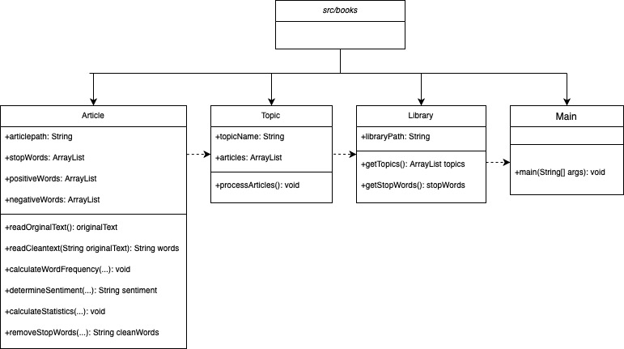

Programming Workshop Lab Semester Project- Milestone 2  

Purpose: 
The purpose of this project is to process text articles to calculate basic statistics and analyze the sentiment. The goal for milestone 1 is being able to process the article, remove stop words and rank words by frequencies. To do this we created 4 classes, an Article class to read the file, store the words to an arraylist and clean the data and process and remove the stop words, count the words and sort them by frequency; a Topic class which calls the functions in the Article class for each article in a topic; and a Libray class to processes each topic.
 For milestone 2 we compared the articles based on vocabulary and attitude. To calculate the richest vocab, we returned the number of unique words for a given article (Article class). To find the most repeated words we created an arraylist 'frequencies' with frequencies set for each word in 'uniqueWords' and found the maximum value. To do the sentiment analysis we process text files of positive and negative words and store them in arraylists, in the Library class. Then in the Article class we counted the number of positive and negative words appeared in a given article, determining if an article was positive, negative or neutral. 

Credits: 
Authors: 
Mariella Aletti 
Sofia Morgillo 
Nazli Yaglidere 

Articles Used: 
'Nearly a Century Later, We’re Still Reading — and Changing Our Minds About — Gatsby' by Parul Sehgal https://www.nytimes.com/2020/12/30/books/great-gatsby-fitzgerald-copyright.html 
'The Great Gatsby by F Scott Fitzgerald - review' by ThePinkElephant https://www.theguardian.com/childrens-books-site/2013/sep/12/review-great-gatsby-f-scott-fitzgerald 
'[The Great Gatsby]: A Review' by Jane@GreenishBookshelf https://greenishbookshelf.com/2017/05/31/the-great-gatsby-a-review/ 

'Book Review: To Kill a Mockingbird (Harper Lee). by Aarti Athavle https://booksandbluess.co.in/2021/04/18/book-review-to-kill-a-mockingbird-harper-lee/ 
'To Kill a Mockingbird by Harper Lee- review' by David https://www.theguardian.com/books/2013/oct/17/review-to-kill-a-mockingbird-harper-lee 
'Book Review: To Kill a Mockingbird' by Ethan M https://ppld.org/book-reviews/kill-mockingbird-1 

'The Outsiders by SE Hinton- review' by Hemma https://www.theguardian.com/childrens-books-site/2015/sep/23/the-outsiders-s-e-hinton-review 
'Book Review: The Outsiders' by Sophie L. https://ppld.org/book-reviews/outsiders-0 
''The Outsiders': 40 Years Later' by Dale Peck https://www.nytimes.com/2007/09/23/books/review/Peck-t.html 

Code/Files Used: 
Scanner class to read file https://www.geeksforgeeks.org/different-ways-reading-text-file-java/ 
Split article text to arraylist https://www.w3schools.com/java/ref_string_split.asp 
Bubble sort 'CountWords1.java' 
Minqing Hu and Bing Liu. "Mining and Summarizing Customer Reviews."
 Proceedings of the ACM SIGKDD International Conference on Knowledge
 Discovery and Data Mining (KDD-2004), Aug 22-25, 2004, Seattle,
 Washington, USA  

 UML Diagram:
  
 
  
 

